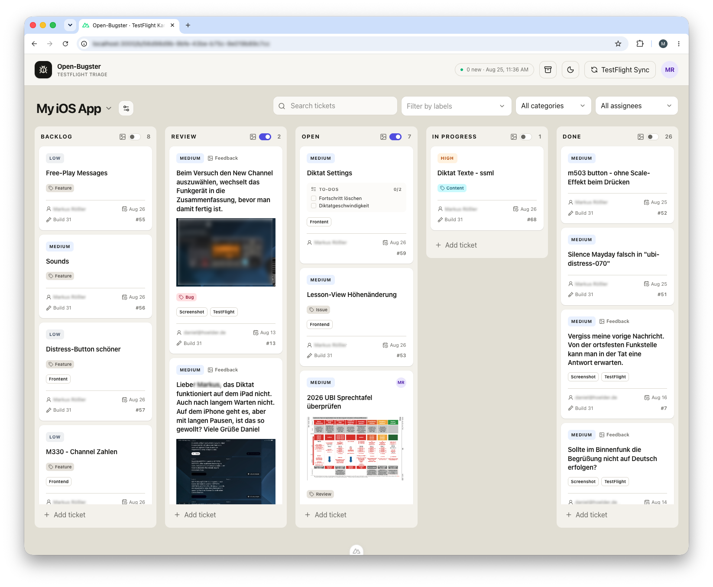
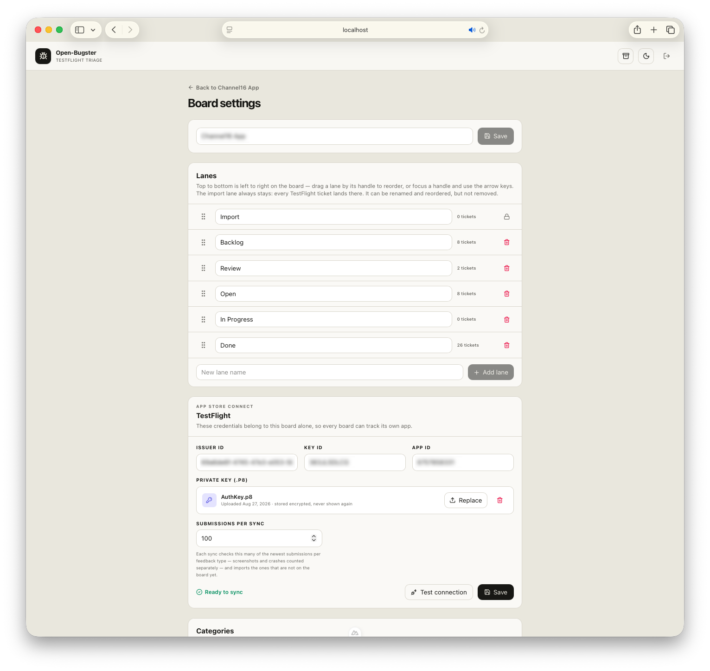

<p align="center">

</p>

# Open-Bugster

Open-Bugster is a lightweight, self-hosted Kanban board for small teams—with a TestFlight integration that turns beta feedback into tickets on its own. Built for independent iOS developers, useful to any team that wants a board of its own, and easy to customize with AI-assisted coding.

## Features

- **Work as a team**  
  Real accounts with per-board roles, ticket assignment, comment threads, and a history on every ticket.
- **Import TestFlight feedback**  
  Screenshots and crash reports land as tickets, with tester, device, system, build, and the original comment attached.
- **Run several boards**  
  Give every app its own board with its own lanes, categories, labels, archive, and App Store Connect credentials.
- **Shape the workflow**  
  Add, rename, drag to reorder, and remove lanes per board—only the import lane is fixed.
- **Move tickets by dragging**  
  Drag cards between lanes and to any position within a lane.
- **Create tickets manually**  
  Capture ideas, tasks, and bugs with priority, due date, build number, and an internal comment.
- **Discuss in the ticket**  
  A comment thread per ticket instead of one shared note, with a history of moves, assignments and priority changes.
- **Organize with categories and labels**  
  One colored category per ticket, plus as many labels as needed. Labels are suggested while typing and created on the fly.
- **Filter and search**  
  Filter by labels, category, or assignee—including everything still unassigned—and search titles, descriptions, to-dos, authors, assignees, build numbers, and ticket numbers.
- **Attach files directly**  
  Add screenshots, documents, and other files to the relevant ticket.
- **Manage to-do lists**  
  Record the next steps within each ticket, reorder them, and work through them systematically.
- **Archive instead of delete**  
  Archived tickets stay restorable by a board administrator and are never re-imported from TestFlight.
- **Light and dark**  
  A theme toggle in the header, remembered per browser.

## The idea behind Open-Bugster

**It is a Kanban board first.** Several boards side by side, lanes you arrange yourself, and tickets with a priority, due date, assignee, labels, a category, a to-do list, attachments, and a comment thread—plus per-board roles so a team can share one instance, and an archive so nothing is ever really lost. None of that needs an Apple account, and a board that imports nothing never even shows an import lane. Used this way it is simply a small, self-hosted work tracker that a team can run for the cost of a container.

**The TestFlight integration is the shortcut on top.** For an iOS team it removes the most tedious part of beta testing: feedback arrives as tickets by itself, with the tester, device, system, locale, build, and the original screenshot or crash report already attached. Nothing gets copied out of App Store Connect by hand, and no device details are re-typed. Because people are matched by email address, a tester who is also on the team shows up as a colleague rather than as a string—and the same will hold for any other source that is wired up later.

**It is deliberately small.** It gives a useful workflow out of the box without trying to become an enterprise issue tracker: no sprints, no burndowns, no workflow engine. That is what makes it suitable for solo developers and small teams who want a practical process without meaningful setup, administration, or hosting costs.

**And it is a launchpad rather than a fixed product.** AI-assisted coding makes it easier than ever to read a compact codebase and bend it to a specific team. Add fields, change the workflow, connect other services, extend the permission model, or deploy it wherever you like.

## Setup

Open-Bugster is one container and one data volume. From nothing to a working board is about five minutes.

**You need** Docker on the machine that will host it, and—only if you want to import TestFlight feedback—an App Store Connect API key (see [App Store Connect](#app-store-connect) below). The board works fine without one.

1. **Get the code and the configuration file.**

   ```bash
   git clone https://github.com/Roeselmann/open-bugster.git
   cd open-bugster
   cp .env.example .env
   ```

2. **Hash your password.** Open-Bugster never stores a password in plain text, so `.env` holds a hash rather than the password itself.

   ```bash
   npm run password:hash -- "your-secure-password"
   ```

   That needs Node.js 22 or newer on the host, but no `npm install`—the script uses nothing but Node's own crypto module. With Docker only, let the container do it instead (this builds the image first, so it takes a minute):

   ```bash
   docker compose run --rm bugster npm run password:hash -- "your-secure-password"
   ```

   Copy the whole `APP_PASSWORD_HASH='scrypt$…'` line it prints into `.env`, unchanged—the single quotes protect the `$` characters. Remember the password you typed; that is what you will sign in with.

3. **Generate the two secrets.** Run this twice and keep both values:

   ```bash
   openssl rand -base64 32
   ```

   One goes into `NUXT_SESSION_PASSWORD` (it signs the login cookie), the other into `BUGSTER_SECRET_KEY` (it encrypts the App Store Connect keys stored in the database).

4. **Say who the first account is.** `APP_ADMIN_EMAIL` becomes your sign-in name and the owner of the instance. Your `.env` should now look like this:

   ```dotenv
   APP_USERNAME=admin
   APP_ADMIN_FIRST_NAME=Ada
   APP_ADMIN_LAST_NAME=Lovelace
   APP_ADMIN_EMAIL=ada@example.com
   APP_PASSWORD_HASH='scrypt$1f3c…$9ab2…'

   NUXT_SESSION_PASSWORD=first-generated-value
   NUXT_SESSION_COOKIE_SECURE=false
   BUGSTER_SECRET_KEY=second-generated-value

   DATABASE_PATH=/data/open-bugster.sqlite
   ATTACHMENTS_PATH=/data/attachments
   ```

   Keep the two paths as they are—they point inside the container. Leave `ASC_*` empty.

5. **Start it.**

   ```bash
   docker compose up --build -d
   ```

   The first start creates the database, a default board, and your owner account.

6. **Sign in** at `http://<host>:3000` with `APP_ADMIN_EMAIL` and the password from step 2.

   From here on the database is the only source of truth: the variables in step 4 are never read again, and passwords are changed in the app. If you mistyped something and cannot get in, see [If nobody can sign in](#if-nobody-can-sign-in).

7. **Set up the board.** Rename it, adjust its lanes, and—if you have an API key—enter the credentials under **Board settings → TestFlight**, press **Test connection**, then **TestFlight Sync** in the header.

8. **Invite your team.** **Users** in the account menu (top right) creates an account and shows a one-time link to pass on. Then add them to the board under **Board settings → Members**, as viewer, editor, or administrator.

### After the first start

Behind an HTTPS reverse proxy, set `NUXT_SESSION_COOKIE_SECURE=true` in `.env` and restart.

Data lives in the named volume `bugster-data`, mounted at `/data`. It survives restarts, image rebuilds, and `docker compose down`—but not `docker compose down -v`. Back it up together with `.env`: without the original `BUGSTER_SECRET_KEY` the stored App Store Connect keys cannot be decrypted again.

Updating is `git pull && docker compose up --build -d`; schema changes are applied automatically on start.

## Working with the board

### Boards

Open-Bugster can run several boards side by side—typically one per app. The board name in the header becomes a dropdown as soon as a second board exists; the icon next to it opens the board settings and is shown to board administrators only, since the page is theirs to act on. A newly created board is selected right away and opens its settings so lanes and credentials can be set up.

Each board owns its lanes, categories, labels, archive, and App Store Connect credentials. Deleting a board removes all of it, including attachments and the stored key.

### Lanes

Lanes are the columns of the board and are configured under **Board settings → Lanes**. Drag a lane by its handle to reorder it, or focus the handle and use the arrow keys. Top to bottom in the settings is left to right on the board.

Every board has exactly one canonical **import lane**, which is where TestFlight feedback lands. It can be renamed and reordered, but not deleted. It only appears on the board once something has actually been imported into it.

When a lane is deleted, its tickets are not lost: the dialog asks whether they should move to another lane or go to the archive.

<p align="center">

</p>

Each lane header carries a switch that shows or hides screenshot previews on its cards. The choice is remembered per lane and browser.

### Tickets

New tickets are created with **Add ticket** at the bottom of a lane, and land in that lane. A ticket holds a title, description, internal comment, priority, due date, build number, to-dos, attachments, one category, and any number of labels. Imported tickets additionally show the original TestFlight feedback with tester, device, system, locale, and build.

Cards are moved by dragging them between lanes or within a lane. On narrow screens each card offers a lane dropdown instead.

**Archive** removes a ticket from the board without losing it, and an archived TestFlight ticket is never imported again by a later sync. Editors archive; the archive itself belongs to the board's administrators. Only they see its icon in the header, reach the archive view, and restore from it—for everyone else an archived ticket is simply gone, including through its own address. The dialog says as much before an editor archives anything.

### Categories

A ticket has at most one category. New categories are created from within a ticket by typing a name that does not exist yet.

Under **Board settings → Categories** each category can be renamed in place with the pencil icon and given one of eight color presets. The color is what the category pill uses on the cards and in the archive, so categories stay recognizable at a glance.

### Labels

Labels are a per-board list, edited directly in the ticket. The field suggests the board's existing labels while typing; a name that does not exist yet is offered as a new entry and created when the ticket is saved. Selected labels appear as pills and are removed with their × or with backspace.

Labels clean themselves up: when the last ticket that carried a label drops it, the label disappears from the board's list. A ticket can hold up to twelve labels of 30 characters each.

Next to the board search sits the same control as a filter. Picking several labels shows the tickets that carry **any** of them.

## Users and access

Open-Bugster is built for a small team sharing one instance. **An account is its email address**: that address is the sign-in name, and it is what every ticket, comment, and imported TestFlight report is matched against.

That matching happens when a page is rendered, not when a ticket is written, which has one useful consequence. A TestFlight report from `jane@example.com` shows the raw address for as long as no account carries it. Create an account with that address a month later and every one of her past reports shows her name and avatar—no re-import, no migration. The same holds for a rename: changing your name in **Your profile** updates it on everything you have ever written.

### Roles

Two levels, kept deliberately small.

| Instance role | What it allows |
| --- | --- |
| **Owner** | The account seeded on first start. Like an administrator, but cannot be demoted, disabled, or deleted. |
| **Administrator** | Manages accounts, creates boards, and has access to every board. |
| **Member** | Sees only the boards they have been added to. |

| Board role | What it allows |
| --- | --- |
| **Viewer** | Read the board and write comments. |
| **Editor** | Everything a viewer can do, plus creating, editing, moving, and archiving tickets. |
| **Administrator** | Everything an editor can do, plus the archive, running a TestFlight sync, lanes, categories, members, the App Store Connect key, and deleting the board. |

Instance administrators always reach every board, so nobody can lock themselves out of their own server.

### Adding someone

Open-Bugster sends no mail, so an invitation is a link you pass on yourself. Under **Users**, enter the person's email and name; the app creates the account and shows a one-time link, valid for seven days, directly beneath their row. They open it, choose a password, and are signed in.

Each row reports what its link is actually doing—*expires in 5 days*, *expired*, or *no invitation link*—so a stale invite is not mistaken for a live one. Only the hash of a link is stored, so it is shown exactly once: **Hide** closes the panel without revoking anything, and the link cannot be displayed again. **New link** issues a fresh one, which immediately invalidates the previous link. **Revoke** stops the current link from working and leaves the account in place, for when an invitation went to the wrong address. An unused link simply lapses after its seven days.

The account exists from the moment you create it, before the link is ever opened—so it can already be added to boards and assigned tickets. Inviting an address that Open-Bugster already knows, because a TestFlight tester used it or an old ticket names it, claims that same person rather than opening a second one: everything already attached to the address belongs to the new account immediately.

### A forgotten password

**Reset password** on the person's row under **Users** issues the same kind of one-time link, valid for seven days, and shows it beneath the row to pass on. They open it, choose a new password, and are signed in. Nothing changes until they do: the old password keeps working while the link is outstanding, so one left uncollected locks nobody out. The moment it is used, the old password stops working and every session that account still had open is signed out. **Revoke** withdraws an outstanding link the same way it does an invitation.

A disabled account gets no link—enable it first, since setting a password signs the holder in. The owner account is reset with `npm run owner:reset` on the server instead, so that holding an administrator account is not a way to take it over; see [If nobody can sign in](#if-nobody-can-sign-in).

**Disable** blocks sign-in and ends any session that account still has open, while keeping everything it wrote.

**Anonymize** erases the person and keeps their work. Their name and email address are removed everywhere—including inside each ticket's history, which stores people by reference rather than by address—while every ticket, comment, and assignment stays where it is and stays recognisable as one person's. They are dropped from every board and can no longer sign in. This cannot be undone: an anonymized account cannot be renamed, re-enabled, or invited back, because doing so would hand the erased person's history to whoever the row was pointed at next. Only deleting it outright is still possible.

**Delete** removes the account outright. Its tickets, comments, and history stay on the boards but lose the person behind them. Anonymize when the history should still read as somebody's; delete only when the row itself should not exist.

### Members of a board

**Board settings → Members** lists who has access and at what role, and board administrators add and remove people and change their role there. The settings icon in the header is offered to them only; the page itself stays readable for anyone who has its address, and shows the roster without any of the controls. A board always keeps at least one administrator.

### Assignment and discussion

A ticket can be assigned to any member of its board, and the assignee's avatar appears on the card. The **All assignees** filter next to the search box narrows the board to your own work, to a colleague's, or to everything nobody has picked up yet.

Each ticket carries a comment thread—viewers included—and a history that records when it was created, moved, assigned, re-prioritised, archived, or restored. Authors edit and delete their own comments; board administrators can also remove someone else's.

### Your profile

Name, email address, and password live under **Your profile** in the account menu. Changing your address moves everything you have filed, written, or been assigned along with you—nothing is left behind at the old one, and the old address becomes free again. If the new address is one Open-Bugster already knew—because you left TestFlight feedback from it before you had an account—that history is folded into your account rather than refused. An address another account holds is refused. Changing your password signs out every other device.

### If nobody can sign in

The owner is seeded from the bootstrap variables **only on the very first start**, and only when `APP_PASSWORD_HASH` is set. If it was missing, the database comes up with its default board but no account, and the login page rejects everything—the server log says so on every start:

```
[open-bugster] No account exists yet, so nobody can sign in: APP_PASSWORD_HASH is not set.
```

Because the seed never runs again once an account exists, a forgotten password cannot be fixed by editing `.env` either. Both cases are handled by the same command, run on the host that holds the database:

```bash
npm run owner:reset -- you@example.com "a-new-long-password"
```

It reads `DATABASE_PATH` from the environment or from `.env`, and then:

- **the address exists**—sets the new password, re-enables the account if it was disabled, and signs out every session it still had open;
- **there are no accounts at all**—creates that address as the **owner**, with administrator access to every existing board;
- **the address is unknown but others exist**—changes nothing and lists the addresses that do exist.

In Docker, run it inside the container so it sees the same volume:

```bash
docker compose exec bugster npm run owner:reset -- you@example.com "a-new-long-password"
```

## App Store Connect

Importing TestFlight feedback requires an App Store Connect API key. Credentials are configured **in the app, per board**, so every board tracks its own app.

### What is needed

| Value | Where it comes from |
| --- | --- |
| **Issuer ID** | App Store Connect → Users and Access → Integrations → App Store Connect API |
| **Key ID** | Shown next to the generated key; it also appears in the downloaded filename, for example `AuthKey_ABC123DEFG.p8` |
| **Private key (`.p8`)** | Downloaded once when the key is created. Apple does not allow a second download—keep an encrypted backup |
| **App ID** | The numeric App Store Connect resource ID of the app, **not** its bundle ID |

The key needs at least the Developer, App Manager, or Admin role for the app.

### Entering them

Open **Board settings → TestFlight**, enter issuer ID, key ID, and app ID, upload the `.p8` exactly as downloaded, and save. The key is verified on upload and stored AES-256-GCM encrypted in the database; it is never written to disk and never sent back to the browser. It can be replaced or removed at any time, but never displayed again.

Set `BUGSTER_SECRET_KEY` in `.env` to a random 32-byte value **before** uploading a key:

```bash
openssl rand -base64 32
```

If it is left empty, the encryption key is derived from `NUXT_SESSION_PASSWORD` instead. That keeps existing installations working, but changing the session password then makes every stored `.p8` unreadable and the keys have to be uploaded again.

Never paste the key contents into `.env`, and never commit credentials or private keys.

### Test connection

**Test connection** asks Apple to resolve the configured app with the stored key and reports the app name and bundle ID it reached. It imports nothing and writes nothing, so it is safe to press at any time.

It checks the values currently **in the form**, saved or not—so a corrected key ID can be verified before storing it. Only the `.p8` always comes from the vault, because it never leaves the server. A note appears above the buttons while the form differs from what is stored.

### Sync

**TestFlight Sync** in the header imports everything that is not on the board yet. It runs on the board's own Apple credentials, so the button—and the line reporting the last run beside it—belongs to board administrators; everyone else sees the imported tickets, not the control. New tickets land in the import lane and carry a `TestFlight` label plus `Screenshot` or `Crash`; screenshots are attached as files.

**Submissions per sync** controls how far back a sync looks. Apple returns feedback newest first; each sync checks this many of the newest submissions per feedback type—screenshots and crashes counted separately. The default is 100. Raise it for a deeper first backfill, lower it to keep routine syncs cheap.

**Attribute imports to their tester** decides whether an imported submission names its tester as the ticket's author. It is on by default and only takes effect when that tester already has an account here; everyone else is still recorded on the ticket as its TestFlight tester, and becomes its author retroactively if they are invited later. Turn it off for a board whose imports should stay unattributed. Either way a board administrator can set the author by hand under **Author** in the ticket, which is also how an import that arrived before anyone had an account gets one afterwards.

### Upgrading from a single board

Installations that configured TestFlight through the `ASC_ISSUER_ID`, `ASC_KEY_ID`, `ASC_APP_ID`, and `ASC_PRIVATE_KEY_PATH` variables keep working. On the first start after the upgrade, all existing tickets become a board named **Workboard** whose lanes match the previous columns, and those four values—including the `.p8` read from `ASC_PRIVATE_KEY_PATH`—are imported into it.

After that first start the variables are no longer read, and the `.p8` bind mount in `docker-compose.yml` can be removed. Verify the import under **Board settings → TestFlight** before deleting anything.

## How Open-Bugster stores data

Open-Bugster does not require a separate database server. All structured data is stored in a SQLite file, while uploaded and TestFlight-imported files are stored in a separate attachments directory.

| Setting | Purpose |
| --- | --- |
| `DATABASE_PATH` | Path to the SQLite file, for example `./data/real/open-bugster.sqlite` |
| `ATTACHMENTS_PATH` | Path to the corresponding attachments directory |

The two paths belong together—switch, copy, and back them up as one unit, and restart Open-Bugster after changing `.env`. Schema updates are applied automatically on start.

If the configured database does not exist, Open-Bugster creates it on first access. An empty application therefore does not necessarily mean that data was deleted: `DATABASE_PATH` often points to a different, newly created file.

Existing installations may continue to use a database file named `bugster.sqlite`; no rename is required.

## Local development

Requirements: Node.js 22 or newer.

```bash
npm install
cp .env.example .env
npm run password:hash -- "your-secure-password"
```

Fill in `.env` as described in [Setup](#setup) steps 2 to 4. The paths there point at the Docker container, so set local ones instead:

```dotenv
DATABASE_PATH=./data/local/open-bugster.sqlite
ATTACHMENTS_PATH=./data/local/attachments
```

```bash
npm run dev
```

The directories, the SQLite file, and a default board are created automatically. `data`, `.env`, and `secrets` are excluded from Git and must not be committed. A board works without App Store Connect credentials; the sync then reports a clear configuration error.

Any number of data sets can live side by side—switching is a matter of pointing both paths at another directory while the dev server is stopped. To work with a copy of the Docker data, stop the container first so the SQLite file, its WAL, and the attachments form a consistent snapshot:

```bash
docker compose stop bugster
mkdir -p data/real
docker compose cp bugster:/data/. data/real/
```

The copy is an independent data set from that point on and is never written back to the volume.

## Quality assurance

```bash
npm test
npm run typecheck
npm run build
```

## Operations

```bash
npm run password:hash -- "a-long-password"        # hash for APP_PASSWORD_HASH in .env
npm run owner:reset -- you@example.com "a-password"  # restore access, see "If nobody can sign in"
```

## API

Authentication and accounts

- `POST /api/auth/login`, `POST /api/auth/logout`
- `GET /api/users`, `POST /api/users`, `PATCH /api/users/:id`, `DELETE /api/users/:id`
- `POST /api/users/:id/invite`, `POST /api/users/:id/anonymize`
- `GET /api/invite/:token`, `POST /api/invite/:token`
- `PATCH /api/profile`, `POST /api/profile/password`

Boards, lanes, and credentials

- `GET /api/boards`, `POST /api/boards`
- `PATCH /api/boards/:id`, `DELETE /api/boards/:id`
- `POST /api/boards/:id/lanes`, `PATCH /api/boards/:id/lanes/:laneId`, `DELETE /api/boards/:id/lanes/:laneId`
- `PATCH /api/boards/:id/lane-order`
- `POST /api/boards/:id/key`, `DELETE /api/boards/:id/key`
- `POST /api/boards/:id/test-connection`
- `GET /api/boards/:id/members`, `GET /api/boards/:id/members/candidates`
- `PUT /api/boards/:id/members/:userId`, `DELETE /api/boards/:id/members/:userId`

Tickets

- `GET /api/tickets`, `POST /api/tickets`
- `GET /api/tickets/:id`, `PATCH /api/tickets/:id`
- `PATCH /api/tickets/:id/position`
- `POST /api/tickets/:id/archive`, `POST /api/tickets/:id/restore`
- `POST /api/tickets/:id/attachments`
- `GET /api/attachments/:id`, `DELETE /api/attachments/:id`

Categories and labels

- `GET /api/categories`, `PATCH /api/categories/:id`, `DELETE /api/categories/:id`
- `GET /api/labels`

TestFlight

- `POST /api/import/testflight`, `GET /api/import/latest`
