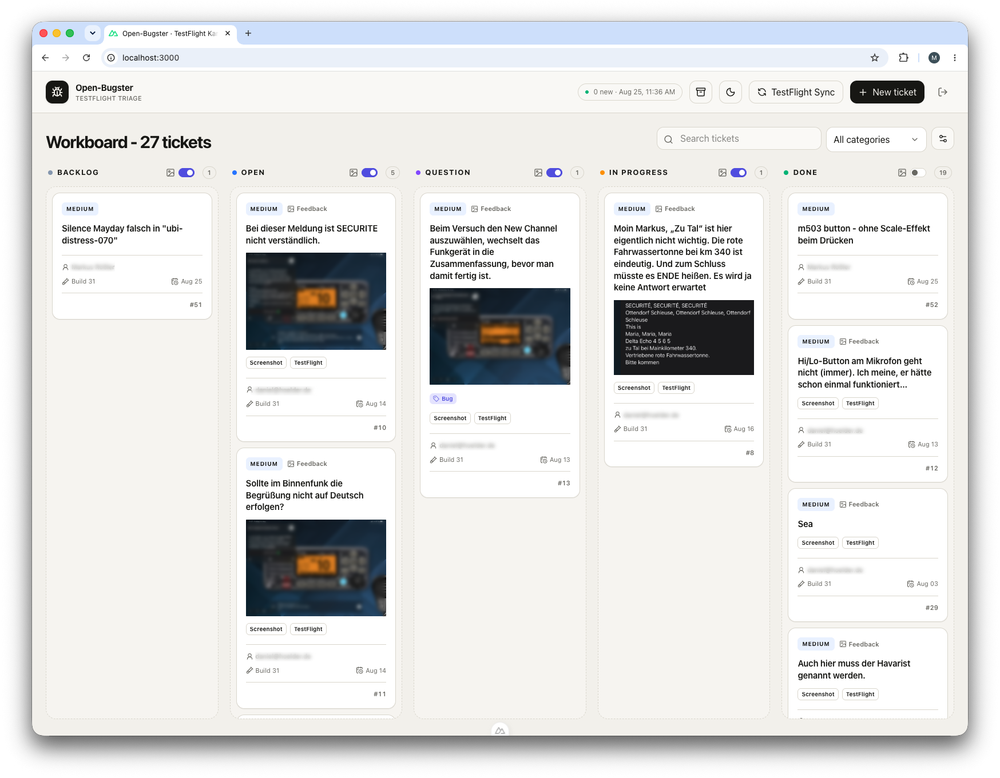

<p align="center">

</p>

# Open-Bugster

Open-Bugster is a lightweight, self-hosted Kanban board that turns TestFlight feedback into actionable tickets—built for independent iOS developers and small teams, and easy to customize with AI-assisted coding.

## Features

- **Import TestFlight tickets**  
  Bring feedback and insights from TestFlight directly into the command board.
- **Create tickets manually**  
  Quickly capture ideas, tasks, and bugs in one central place.
- **Attach files directly**  
  Add screenshots, documents, and other files to the relevant ticket.
- **Manage to-do lists**  
  Record the next steps within each ticket and work through them systematically.

## The idea behind Open-Bugster

Open-Bugster gives independent iOS developers and small teams a fast, simple, and affordable way to turn TestFlight feedback into an actionable ticket workflow. Instead of copying feedback by hand or adopting a large project-management platform, developers can import TestFlight reports into a focused Kanban board, add manual tickets, prioritize the work, and resolve issues together.

The application is intentionally small and straightforward. It provides a useful workflow out of the box without trying to become a complete enterprise issue tracker. This makes it suitable for solo developers and small teams that need a practical process without significant setup, administration, or hosting costs.

Open-Bugster is also intended as a launchpad rather than a fixed product. AI-assisted coding makes it easier than ever to understand and adapt a compact codebase to a team's specific needs. Developers can add fields, change the workflow, connect other services, introduce full multi-user accounts and permissions, or deploy the application on their preferred infrastructure. The goal is to provide a solid starting point from which small iOS teams can establish and evolve their own ticket workflow quickly.

## How Open-Bugster stores data

Open-Bugster does not require a separate database server. All structured data is stored in a SQLite file, while uploaded and TestFlight-imported files are stored in a separate attachments directory.

| Setting | Purpose |
| --- | --- |
| `DATABASE_PATH` | Path to the SQLite file, for example `./data/empty/open-bugster.sqlite` |
| `ATTACHMENTS_PATH` | Path to the corresponding attachments directory |

If the configured database does not exist, Open-Bugster creates it on first access. An empty application therefore does not necessarily mean that data was deleted: `DATABASE_PATH` often points to a different, newly created file.

The database and attachments paths belong together. Always switch, copy, and back them up as one unit. Restart Open-Bugster after changing `.env`.

Existing installations may continue to use a database file named `bugster.sqlite`; no data-file rename is required. The configured paths determine which files are used.

## Local development

Requirements: Node.js 22 or newer.

```bash
npm install
cp .env.example .env
npm run password:hash -- "your-secure-password"
```

Copy the generated `APP_PASSWORD_HASH` line into `.env` without modifying it. The single quotes protect the `$` characters in the hash.

The paths in `.env.example` are intended for Docker. For a new, empty local development database, set these values in `.env`:

```dotenv
DATABASE_PATH=./data/empty/open-bugster.sqlite
ATTACHMENTS_PATH=./data/empty/attachments
ASC_PRIVATE_KEY_PATH=./secrets/AuthKey.p8
```

Then start the application:

```bash
npm run dev
```

The directories and SQLite file are created automatically. `data`, `.env`, and `secrets` are excluded from Git and must not be committed. The manual board works without a complete Apple configuration; the sync reports a clear configuration error.

`APP_ADMIN_FIRST_NAME`, `APP_ADMIN_LAST_NAME`, and `APP_ADMIN_EMAIL` define the administrator identity. A fixed snapshot of that identity is stored as the author whenever a manual ticket is created.

### Switching between real and empty local databases

You can maintain any number of separate local data sets. The two paths in `.env` determine which one is active.

Real local working copy:

```dotenv
DATABASE_PATH=./data/real/open-bugster.sqlite
ATTACHMENTS_PATH=./data/real/attachments
```

Empty test database:

```dotenv
DATABASE_PATH=./data/empty/open-bugster.sqlite
ATTACHMENTS_PATH=./data/empty/attachments
```

Stop the development server before switching, change both lines, and restart with `npm run dev`. Data sets are not synchronized automatically: changes in `data/real` do not appear in `data/empty` or in a Docker volume.

### Reusing existing Docker data locally

The safest approach is to work with a copy. This keeps the original Docker volume unchanged as a fallback. Stop Docker first so the SQLite database, WAL files, and attachments form a consistent snapshot:

```bash
docker compose stop bugster
mkdir -p data/real
docker compose cp bugster:/data/. data/real/
```

Then configure the copied database and attachment paths in `.env`. Use the actual database filename present in `data/real`:

```dotenv
DATABASE_PATH=./data/real/open-bugster.sqlite
ATTACHMENTS_PATH=./data/real/attachments
ASC_PRIVATE_KEY_PATH=./secrets/AuthKey.p8
```

Open-Bugster can now be started locally with `npm run dev`. Keeping Docker stopped also prevents a conflict on port 3000. The local copy is an independent data set from this point onward and is not written back to the Docker volume.

## App Store Connect

Importing feedback requires a team key ID, issuer ID, app ID, and the `.p8` private key that can only be downloaded once. The key needs at least the Developer, App Manager, or Admin role for the app.

The Docker setup below explains exactly where to place the key. Never paste the key contents into `.env`, and never commit credentials or private keys.

## Docker

Run all commands in this section on the Docker host from the Open-Bugster directory—the directory that contains `docker-compose.yml`.

### First-time setup

1. Create the configuration file and the directory for the Apple private key:

   ```bash
   cp .env.example .env
   mkdir -p secrets
   ```

   If `.env` already exists, do not run the `cp` command again because it would overwrite the current configuration.

2. In App Store Connect, create or select an API key with at least the Developer, App Manager, or Admin role. Download its `.p8` file. Apple only allows this file to be downloaded once, so keep an additional encrypted backup.

   Apple usually names the downloaded file something like `AuthKey_ABC123DEFG.p8`. Open-Bugster expects it on the Docker host at exactly this location and name:

   ```text
   <open-bugster-directory>/secrets/AuthKey.p8
   ```

3. Copy and rename the downloaded key. Replace the example source path with the actual location and filename of your download:

   ```bash
   cp /path/to/downloaded/AuthKey_ABC123DEFG.p8 ./secrets/AuthKey.p8
   chmod 600 ./secrets/AuthKey.p8
   ```

   If Docker runs on a remote server, first create the `secrets` directory there as shown in step 1. Then run this command on the computer where the key was downloaded, replacing the username, host, and project path:

   ```bash
   scp /path/to/downloaded/AuthKey_ABC123DEFG.p8 admin@example.com:/path/to/open-bugster/secrets/AuthKey.p8
   ```

   Return to the server and restrict access to the copied file:

   ```bash
   cd /path/to/open-bugster
   chmod 600 ./secrets/AuthKey.p8
   ```

4. Confirm that the file exists in the correct location. The command must show a regular file named `AuthKey.p8`, not a directory:

   ```bash
   ls -l ./secrets/AuthKey.p8
   ```

5. Open `.env` in a text editor and enter the App Store Connect values:

   ```dotenv
   ASC_ISSUER_ID=your-issuer-id
   ASC_KEY_ID=ABC123DEFG
   ASC_APP_ID=your-app-id
   ASC_PRIVATE_KEY_PATH=/run/secrets/appstoreconnect.p8
   ```

   `ASC_KEY_ID` is the key ID shown in App Store Connect and usually matches the part after `AuthKey_` in the downloaded filename. `ASC_APP_ID` is the App Store Connect resource ID of the app, not its bundle ID.

   Keep `ASC_PRIVATE_KEY_PATH` exactly as shown. It is the path inside the container. Docker automatically mounts the host file `./secrets/AuthKey.p8` there as a read-only file.

6. In the same `.env` file, make sure the database paths use the container locations:

   ```dotenv
   DATABASE_PATH=/data/open-bugster.sqlite
   ATTACHMENTS_PATH=/data/attachments
   ```

7. Start Open-Bugster:

   ```bash
   docker compose up --build -d
   ```

8. Check that the container is running and can see the key:

   ```bash
   docker compose ps
   docker compose exec bugster sh -c 'test -r /run/secrets/appstoreconnect.p8 && echo "App Store Connect key is readable"'
   ```

   If the second command prints `App Store Connect key is readable`, the file is mounted correctly. If it reports a permission error on Linux, allow the container's `node` group to read the file and run the check again:

   ```bash
   sudo chgrp 1000 ./secrets/AuthKey.p8
   chmod 640 ./secrets/AuthKey.p8
   ```

   Open `http://<host>:3000`, sign in, and run **TestFlight Sync** to verify the complete App Store Connect configuration.

The Compose service `bugster` and named volume `bugster-data` are mounted at `/data` inside the container. These technical identifiers are intentionally retained for compatibility with installations created before the project was renamed to Open-Bugster. Renaming them would leave the previous container or volume disconnected during an upgrade. Docker Compose normally prefixes the actual volume name with the Compose project name, for example `bugster_bugster-data`. List available volumes with:

```bash
docker volume ls
```

The volume survives container restarts, image rebuilds, and `docker compose down`. It is deleted by commands such as `docker compose down -v`, `docker volume rm`, or Docker Desktop data cleanup. A different directory name or Compose project name can also create a new, initially empty volume while the old volume still exists.

The included configuration serves Open-Bugster directly at `http://<host>:3000`. When it runs behind an HTTPS reverse proxy, set `NUXT_SESSION_COOKIE_SECURE=true` in `.env`.

## Backups

A backup must contain both the SQLite files and the complete attachments directory. SQLite uses WAL mode, so copying only the main database file from a running application is unsafe.

Complete Docker backup with a short interruption:

```bash
OPEN_BUGSTER_BACKUP_DIR="../open-bugster-backup-$(date +%Y%m%d-%H%M%S)"
mkdir -p "$OPEN_BUGSTER_BACKUP_DIR"
docker compose stop bugster
docker compose cp bugster:/data/. "$OPEN_BUGSTER_BACKUP_DIR/"
docker compose start bugster
```

For complete disaster recovery, also retain `.env`, `secrets/AuthKey.p8`, and the exact Open-Bugster release or Git commit. These files contain credentials and must be backed up separately in encrypted storage. The `.p8` key is especially important because Apple does not allow it to be downloaded again.

The backup root must contain the database file configured by `DATABASE_PATH` and the `attachments` directory. New installations use `open-bugster.sqlite`; upgraded installations may still use `bugster.sqlite`. If the `sqlite3` command is available, verify the copied database:

```bash
OPEN_BUGSTER_DATABASE_FILE="open-bugster.sqlite"
test -f "$OPEN_BUGSTER_BACKUP_DIR/$OPEN_BUGSTER_DATABASE_FILE"
test -d "$OPEN_BUGSTER_BACKUP_DIR/attachments"
sqlite3 "$OPEN_BUGSTER_BACKUP_DIR/$OPEN_BUGSTER_DATABASE_FILE" "PRAGMA integrity_check;"
```

The last command must output `ok`. A backup is only proven when it has been restored successfully on a separate test installation.

Copy the completed backup to another drive, a NAS, or encrypted cloud storage. A backup on the same Docker volume or physical drive does not protect against volume, device, or filesystem loss.

For local development, back up the entire active data directory, such as `data/real`, while the development server is stopped.

### Disaster recovery: restoring a Docker backup

The following procedure completely replaces the active Docker volume with a backup. It applies both to a new host and to recovery after corruption or accidental data deletion.

1. Check out the same or a newer Open-Bugster version. Restore `.env` and `secrets/AuthKey.p8`, and verify the Docker paths. `DATABASE_PATH` must match the filename contained in the backup:

   ```dotenv
   DATABASE_PATH=/data/open-bugster.sqlite
   ATTACHMENTS_PATH=/data/attachments
   ASC_PRIVATE_KEY_PATH=/run/secrets/appstoreconnect.p8
   ```

2. Set the absolute path to the backup and verify its contents. Do not modify the backup during recovery:

   ```bash
   OPEN_BUGSTER_RESTORE_DIR="/absolute/path/to/open-bugster-backup-20260826-120000"
   OPEN_BUGSTER_DATABASE_FILE="open-bugster.sqlite"
   test -f "$OPEN_BUGSTER_RESTORE_DIR/$OPEN_BUGSTER_DATABASE_FILE"
   test -d "$OPEN_BUGSTER_RESTORE_DIR/attachments"
   ```

3. If the old container and volume are still readable, create one additional emergency backup before restoring:

   ```bash
   OPEN_BUGSTER_PRE_RESTORE_DIR="../open-bugster-pre-restore-$(date +%Y%m%d-%H%M%S)"
   mkdir -p "$OPEN_BUGSTER_PRE_RESTORE_DIR"
   docker compose stop bugster
   docker compose cp bugster:/data/. "$OPEN_BUGSTER_PRE_RESTORE_DIR/"
   ```

4. Remove the old volume, create a clean volume, and copy the backup into it. **Warning:** `docker compose down -v` permanently deletes the volume belonging to the current Compose project. Run this step only after verifying the backup or when the old volume has already been lost. Run every command from the same project directory and with the same Compose project name.

   ```bash
   docker compose down -v
   docker compose build bugster
   docker compose create bugster
   docker compose cp "$OPEN_BUGSTER_RESTORE_DIR/." bugster:/data/
   docker compose run --rm --user root --entrypoint chown bugster -R node:node /data
   docker compose start bugster
   ```

5. Verify the technical startup and then inspect the restored data in the web interface:

   ```bash
   docker compose ps
   docker compose logs --tail=100 bugster
   ```

   Sign in, open several tickets, and download at least one attachment. If Open-Bugster starts empty, first check the three paths in `.env`, the Compose project name, and the mounted volume. Open-Bugster automatically creates an empty database when `DATABASE_PATH` points to the wrong location.

If recovery fails, stop Open-Bugster and repeat the procedure with the emergency backup or an older verified backup. Keep the original backup unchanged until verification is complete.

### Restoring a local backup

Stop the development server and copy the backup into a new data directory. This preserves the current local state as a fallback:

```bash
OPEN_BUGSTER_RESTORE_DIR="/absolute/path/to/open-bugster-backup-20260826-120000"
mkdir -p data/restored
cp -a "$OPEN_BUGSTER_RESTORE_DIR/." data/restored/
```

Update both paths in `.env` and restart Open-Bugster. The database filename must match the restored file:

```dotenv
DATABASE_PATH=./data/restored/open-bugster.sqlite
ATTACHMENTS_PATH=./data/restored/attachments
ASC_PRIVATE_KEY_PATH=./secrets/AuthKey.p8
```

```bash
npm run dev
```

Inspect tickets and attachments after startup. Use a new target directory for each recovery attempt instead of mixing different backups in one directory.

### Recommended disaster-recovery plan

- Define the backup interval and maximum acceptable data loss, such as daily backups with no more than 24 hours of data loss.
- Retain multiple generations and store at least one copy outside the Docker host.
- Store `.env` and `AuthKey.p8` encrypted and separately from application data.
- Record the Open-Bugster release or Git commit for every backup.
- Test recovery regularly on a separate system and record the time and result.
- Document the responsible person, backup location, and expected recovery time.

### Moving data to another Open-Bugster installation

Use the complete backed-up data directory with the same or a newer Open-Bugster version. For Docker, copy it into the target `/data` volume. For local development, place it in a directory such as `data/real` and select it through `.env`. Always back up the current target installation before replacing it.

Another application can only use the SQLite file if it understands the Open-Bugster database schema. A dedicated JSON or CSV export is more suitable for exchanging data with unrelated systems.

## Quality assurance

```bash
npm test
npm run typecheck
npm run build
```

## API

- `POST /api/auth/login`, `POST /api/auth/logout`
- `GET /api/tickets`, `POST /api/tickets`
- `GET /api/tickets/:id`, `PATCH /api/tickets/:id`
- `PATCH /api/tickets/:id/position`
- `POST /api/tickets/:id/archive`, `POST /api/tickets/:id/restore`
- `POST /api/import/testflight`, `GET /api/import/latest`
- `GET /api/attachments/:id`
- `POST /api/tickets/:id/attachments`
- `DELETE /api/attachments/:id`
