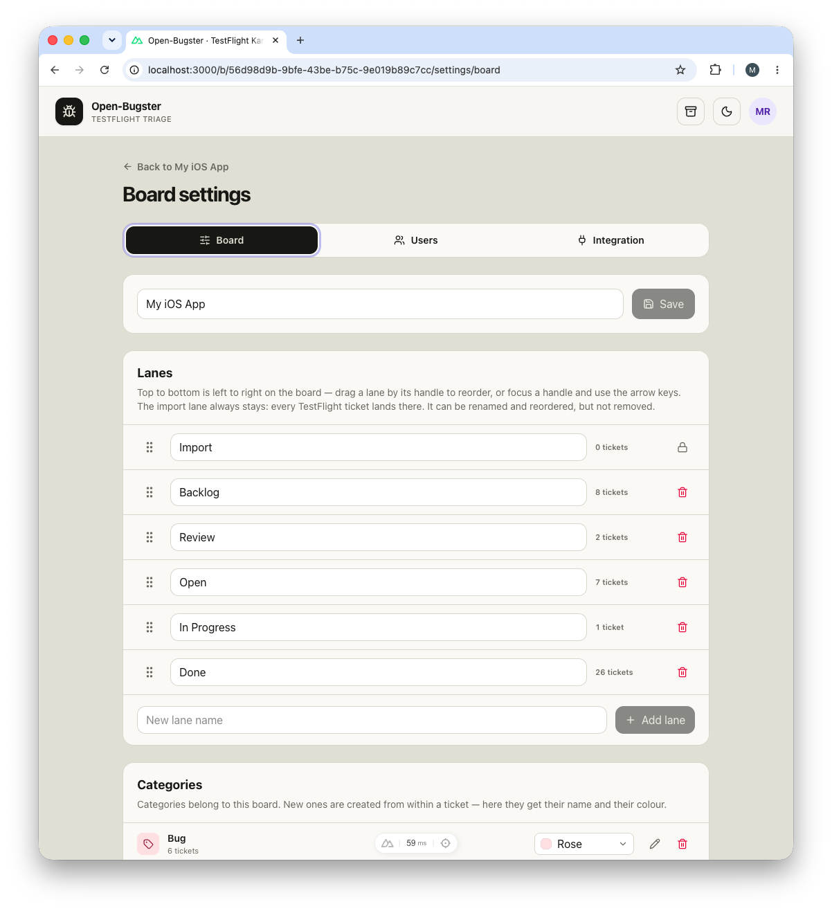

<p align="center">

</p>

# Open-Bugster

Open-Bugster is a lightweight, self-hosted Kanban board that is meant to be driven by other software as much as by people. It started as the shortest path from TestFlight feedback to a ticket — App Store Connect is still the one integration that ships built in — but everything the board can do is also a REST endpoint, an MCP tool, and an outgoing webhook, so any application, script, or AI agent can work the same board with the same permissions.

## Features

### A board first

- **Work as a team**  
  Real accounts with per-board roles, ticket assignment, comment threads, and a history on every ticket.
- **Run several boards**  
  Give every app or project its own board with its own lanes, categories, labels, and archive.
- **Group boards into workspaces**  
  A level above the boards for teams, clients, or departments — each workspace with its own boards, board order, and administrators. Boards can be moved or duplicated between workspaces.
- **Shape the workflow**  
  Add, rename, drag to reorder, and remove lanes per board—only the import lane is fixed.
- **Move tickets by dragging**  
  Drag cards between lanes and to any position within a lane.
- **Create tickets manually**  
  Capture ideas, tasks, and bugs with priority, due date, build number, and an internal comment.
- **Discuss in the ticket**  
  A comment thread per ticket instead of one shared note, with a history of moves, assignments and priority changes.
- **Organize with categories and labels**  
  One colored category per ticket, plus as many labels as needed. Labels are suggested while typing and created on the fly.
- **Filter and search**  
  Filter by labels, category, or assignee—including everything still unassigned—and search titles, descriptions, to-dos, authors, assignees, build numbers, and ticket numbers.
- **Attach files directly**  
  Add screenshots, documents, and other files to the relevant ticket.
- **Manage to-do lists**  
  Record the next steps within each ticket, reorder them, and work through them systematically.
- **Archive instead of delete**  
  Archived tickets stay restorable by a board administrator and are never re-imported.
- **Light and dark**  
  A theme toggle in the header, remembered per browser.

### Open to any application

- **Drive it from your own tools**  
  A versioned REST API at `/api/v1`, generated from the same definitions that validate the app itself, with a reference you can read in a browser and an OpenAPI document to generate a client from.
- **Connect AI agents**  
  An MCP endpoint lets Claude, Cursor, or anything else that speaks the protocol search a board, file tickets, and comment—reaching exactly as far as its token does, and recorded under the person or service it belongs to.
- **Push events to other systems**  
  Signed webhooks tell n8n, a chat channel, or a build pipeline when a ticket is created, updated, moved, archived, or restored, when somebody comments, and when an import finishes.
- **Give machines their own identity**  
  Scoped tokens, service identities for pipelines and jobs, and an audit trail that records which agent acted through which channel—so automation is accountable rather than anonymous.

### The integration that ships with it

- **Import TestFlight feedback**  
  Screenshots and crash reports land as tickets, with tester, device, system, build, and the original comment attached—per board, on that board's own App Store Connect credentials.

## The idea behind Open-Bugster

**It is a Kanban board first.** Several boards side by side, lanes you arrange yourself, and tickets with a priority, due date, assignee, labels, a category, a to-do list, attachments, and a comment thread—plus per-board roles so a team can share one instance, and an archive so nothing is ever really lost. None of that needs an Apple account, and a board that imports nothing never even shows an import lane. Used this way it is simply a small, self-hosted work tracker that a team can run for the cost of a container.

**App Store Connect is where it started.** For an iOS team the TestFlight import removes the most tedious part of beta testing: feedback arrives as tickets by itself, with the tester, device, system, locale, build, and the original screenshot or crash report already attached. Nothing gets copied out of App Store Connect by hand, and no device details are re-typed. Because people are matched by email address, a tester who is also on the team shows up as a colleague rather than as a string.

**Every other source connects through the API.** Rather than growing an integration per service, the board exposes itself: a versioned REST API, an MCP endpoint for AI agents, and signed outgoing webhooks. A crash reporter, a support inbox, a CI pipeline, an n8n flow, or an agent reading a codebase can all file, move, and comment on tickets—and the same email matching that turns a tester into a colleague works for whatever they bring in. Every entry point runs under the same roles as the browser does, and everything a token does is recorded against the person or service it belongs to, so opening the board to software does not mean opening it wider than a person would be.

**It is deliberately small.** It gives a useful workflow out of the box without trying to become an enterprise issue tracker: no sprints, no burndowns, no workflow engine. That is what makes it suitable for solo developers and small teams who want a practical process without meaningful setup, administration, or hosting costs.

**And it is a launchpad rather than a fixed product.** AI-assisted coding makes it easier than ever to read a compact codebase and bend it to a specific team. Add fields, change the workflow, connect other services, extend the permission model, or deploy it wherever you like.

## Setup

Open-Bugster is one container and one data volume. From nothing to a working board is one command and a couple of minutes.

**You need** Docker on the machine that will host it, and—only if you want to import TestFlight feedback—an App Store Connect API key (see [App Store Connect](#app-store-connect) below). The board works fine without one.

1. **Get the code.**

   ```bash
   git clone https://github.com/Roeselmann/open-bugster.git
   cd open-bugster
   ```

2. **Start it, saying who the first account is.** The email becomes your sign-in name and the owner of the instance; the password needs at least 12 characters.

   ```bash
   APP_ADMIN_EMAIL=ada@example.com APP_ADMIN_PASSWORD='a-long-password' docker compose up --build -d
   ```

   The first start creates the database, a default board, and your owner account—and generates the two machine secrets (the session-cookie key and the encryption key for stored App Store Connect keys) into the data volume, so there is nothing to generate or paste by hand. The bootstrap variables are read exactly this once; the password is hashed immediately and never stored in plain text.

3. **Sign in** at `http://<host>:3000` with that email and password.

   From here on the database is the only source of truth: the bootstrap variables are never read again, and passwords are changed in the app. If you mistyped something and cannot get in, see [If nobody can sign in](#if-nobody-can-sign-in).

4. **Set up the board.** Rename it, adjust its lanes, and—if you have an API key—enter the credentials under **Board settings → TestFlight**, press **Test connection**, then **TestFlight Sync** in the header.

5. **Invite your team.** **Users** in the account menu (top right) creates an account and shows a one-time link to pass on. Then add them to the board under **Board settings → Users**, as viewer, editor, or administrator.

### Configuring through `.env` instead

Everything above can also live in a file, which is the better home for the optional settings anyway:

```bash
cp .env.example .env
```

Fill in `APP_ADMIN_EMAIL`, `APP_ADMIN_PASSWORD`, and—if you like—the first and last name, then start with a plain `docker compose up --build -d`. Two substitutions are available for the cautious:

- **No plain password, even once:** hash it yourself and set `APP_PASSWORD_HASH` instead of `APP_ADMIN_PASSWORD` (the hash wins if both are set). `npm run password:hash -- "your-secure-password"` prints the line to copy into `.env` unchanged—the single quotes protect the `$` characters. It needs Node.js 22 or newer but no `npm install`; with Docker only, `docker compose run --rm bugster npm run password:hash -- "your-secure-password"` does the same inside the container.
- **Secrets under your own management:** set `NUXT_SESSION_PASSWORD` and `BUGSTER_SECRET_KEY` (generate each with `openssl rand -base64 32`). Whatever you set in the environment wins over the generated values in the volume; whatever you leave empty keeps generating itself.

### After the first start

Behind an HTTPS reverse proxy, set `NUXT_SESSION_COOKIE_SECURE=true` in `.env` and restart.

Data lives in the named volume `bugster-data`, mounted at `/data`. It survives restarts, image rebuilds, and `docker compose down`—but not `docker compose down -v`. The generated secrets sit in `secrets.json` inside that same volume, so a volume backup is self-contained; if you keep a `.env`, back it up alongside. Without the original `BUGSTER_SECRET_KEY`—wherever it lives—the stored App Store Connect keys cannot be decrypted again.

Updating is `scripts/update.sh`, which pulls, takes a backup, and rebuilds in one go; schema changes are applied automatically on start. See [Updating and backups](#updating-and-backups) for what that protects and what it cannot.

## Working with the board

### Workspaces

Workspaces group boards — one per team, client, or department. Every instance starts with a single workspace named **Workspace**, and as long as it stays untouched, nothing about workspaces appears anywhere: the app looks and works exactly as it always has. Give that lone workspace a name of its own or a description, and its name appears in the header next to the logo — as a plain title, with the description beside it.

Instance administrators create further workspaces from the **Workspaces** entry in the account menu. The moment a second one exists, the workspace name in the header becomes a switcher, with a settings icon beside it for the workspace's administrators. The workspace settings hold the name and description (shown next to the name in the header), the boards (create new ones, drag them into the order the board switcher offers them in), and the workspace members: a workspace **administrator** manages the workspace and opens boards in it — membership of a workspace grants nothing on its boards, since each board keeps its own members and roles.

A board can be **moved** to another workspace and **duplicated** — into the same workspace or a different one — from **Board settings → Board**, above the danger zone. Moving keeps everything, members and credentials included, and only changes where the board hangs. Duplicating copies the structure (lanes, categories, labels, members) with an optional **Include tickets** switch; the App Store Connect key, webhooks, comments, and history always stay with the original.

### Boards

Open-Bugster can run several boards side by side—typically one per app. The board name in the header becomes a dropdown as soon as a second board exists; the icon next to it opens the board settings and is shown to board administrators only, since the page is theirs to act on. A newly created board is selected right away and opens its settings so lanes and credentials can be set up.

The settings themselves are split into three sections: **Board** for the name, lanes, categories, and deletion, **Users** for who has access, and **Integration** for the App Store Connect key.

Each board owns its lanes, categories, labels, archive, and App Store Connect credentials. Deleting a board removes all of it, including attachments and the stored key.

### Lanes

Lanes are the columns of the board and are configured under **Board settings → Board**. Drag a lane by its handle to reorder it, or focus the handle and use the arrow keys. Top to bottom in the settings is left to right on the board.

Every board has exactly one canonical **import lane**, which is where TestFlight feedback lands. It can be renamed and reordered, but not deleted. It only appears on the board once something has actually been imported into it.

When a lane is deleted, its tickets are not lost: the dialog asks whether they should move to another lane or go to the archive.

<p align="center">

</p>

Each lane header carries a switch that shows or hides screenshot previews on its cards. The choice is remembered per lane and browser.

### Tickets

New tickets are created with **Add ticket** at the bottom of a lane, and land in that lane. A ticket holds a title, description, internal comment, priority, due date, build number, to-dos, attachments, one category, and any number of labels. Imported tickets additionally show the original TestFlight feedback with tester, device, system, locale, and build.

Cards are moved by dragging them between lanes or within a lane. On narrow screens each card offers a lane dropdown instead.

**Archive** removes a ticket from the board without losing it, and an archived TestFlight ticket is never imported again by a later sync. Editors archive; the archive itself belongs to the board's administrators. Only they see its icon in the header, reach the archive view, and restore from it—for everyone else an archived ticket is simply gone, including through its own address. The dialog says as much before an editor archives anything.

### Categories

A ticket has at most one category. New categories are created from within a ticket by typing a name that does not exist yet.

Under **Board settings → Board** each category can be renamed in place with the pencil icon and given one of eight color presets. The color is what the category pill uses on the cards and in the archive, so categories stay recognizable at a glance.

### Labels

Labels are a per-board list, edited directly in the ticket. The field suggests the board's existing labels while typing; a name that does not exist yet is offered as a new entry and created when the ticket is saved. Selected labels appear as pills and are removed with their × or with backspace.

Labels clean themselves up: when the last ticket that carried a label drops it, the label disappears from the board's list. A ticket can hold up to twelve labels of 30 characters each.

Next to the board search sits the same control as a filter. Picking several labels shows the tickets that carry **any** of them.

## Users and access

Open-Bugster is built for a small team sharing one instance. **An account is its email address**: that address is the sign-in name, and it is what every ticket, comment, and imported TestFlight report is matched against.

That matching happens when a page is rendered, not when a ticket is written, which has one useful consequence. A TestFlight report from `jane@example.com` shows the raw address for as long as no account carries it. Create an account with that address a month later and every one of her past reports shows her name and avatar—no re-import, no migration. The same holds for a rename: changing your name in **Your profile** updates it on everything you have ever written.

### Roles

Two levels, kept deliberately small.

| Instance role | What it allows |
| --- | --- |
| **Owner** | The account seeded on first start. Like an administrator, but cannot be demoted, disabled, or deleted. |
| **Administrator** | Manages accounts, creates workspaces, and has access to every workspace and board. |
| **Member** | Sees only the boards they have been added to, and the workspaces around them. |

| Board role | What it allows |
| --- | --- |
| **Viewer** | Read the board and write comments. |
| **Editor** | Everything a viewer can do, plus creating, editing, moving, and archiving tickets. |
| **Administrator** | Everything an editor can do, plus the archive, running a TestFlight sync, lanes, categories, members, the App Store Connect key, and deleting the board. |

Instance administrators always reach every board, so nobody can lock themselves out of their own server.

### Adding someone

Open-Bugster sends no mail, so an invitation is a link you pass on yourself. Under **Users**, enter the person's email and name; the app creates the account and shows a one-time link, valid for seven days, directly beneath their row. They open it, choose a password, and are signed in.

Each row reports what its link is actually doing—*expires in 5 days*, *expired*, or *no invitation link*—so a stale invite is not mistaken for a live one. Only the hash of a link is stored, so it is shown exactly once: **Hide** closes the panel without revoking anything, and the link cannot be displayed again. **New link** issues a fresh one, which immediately invalidates the previous link. **Revoke** stops the current link from working and leaves the account in place, for when an invitation went to the wrong address. An unused link simply lapses after its seven days.

The account exists from the moment you create it, before the link is ever opened—so it can already be added to boards and assigned tickets. Inviting an address that Open-Bugster already knows, because a TestFlight tester used it or an old ticket names it, claims that same person rather than opening a second one: everything already attached to the address belongs to the new account immediately.

### A forgotten password

**Reset password** on the person's row under **Users** issues the same kind of one-time link, valid for seven days, and shows it beneath the row to pass on. They open it, choose a new password, and are signed in. Nothing changes until they do: the old password keeps working while the link is outstanding, so one left uncollected locks nobody out. The moment it is used, the old password stops working and every session that account still had open is signed out. **Revoke** withdraws an outstanding link the same way it does an invitation.

A disabled account gets no link—enable it first, since setting a password signs the holder in. The owner account is reset with `npm run owner:reset` on the server instead, so that holding an administrator account is not a way to take it over; see [If nobody can sign in](#if-nobody-can-sign-in).

**Disable** blocks sign-in and ends any session that account still has open, while keeping everything it wrote.

**Anonymize** erases the person and keeps their work. Their name and email address are removed everywhere—including inside each ticket's history, which stores people by reference rather than by address—while every ticket, comment, and assignment stays where it is and stays recognisable as one person's. They are dropped from every board and can no longer sign in. This cannot be undone: an anonymized account cannot be renamed, re-enabled, or invited back, because doing so would hand the erased person's history to whoever the row was pointed at next. Only deleting it outright is still possible.

**Delete** removes the account outright. Its tickets, comments, and history stay on the boards but lose the person behind them. Anonymize when the history should still read as somebody's; delete only when the row itself should not exist.

### Erasure without losing the work

Anonymizing exists because of Article 17 of the [GDPR](https://eur-lex.europa.eu/eli/reg/2016/679/oj), the right to erasure: a person can require that their personal data be erased "without undue delay", and the controller has to comply where the data is no longer necessary for the purpose it was collected for, or the consent it rested on is withdrawn. On a shared board that is normally a painful request to receive. Deleting the account takes the person's tickets, comments, assignments, and history with it or leaves them orphaned, and a team loses a year of context to one address.

The regulation does not ask for that. Personal data is what identifies someone (Article 4(1))—here the name and the email address; the tickets are not. And Recital 26 puts data that can no longer be tied back to a person outside the scope entirely: the principles of data protection "should therefore not apply to anonymous information", with identifiability judged by "all the means reasonably likely to be used" to get back to the person.

So Open-Bugster separates the two. **Anonymize** clears the email, the name, and the password hash from the account row, drops the person from every board, and invalidates every session it had open. The row itself stays, and everything written by it keeps pointing at it. Because the history stores people by reference rather than by address, an entry that read *Jane Doe moved this to Review* becomes *Deleted user moved this to Review* without a single row being rewritten. The work stays legible as one person's work; the person is gone. And because the app keeps no way back—an anonymized account cannot be renamed, re-enabled, or invited back—what remains is anonymous in the sense Recital 26 means, not merely pseudonymous under Article 4(5).

That also settles retention. Article 5(1)(e) allows personal data to be kept in identifying form "for no longer than is necessary"; anonymous data falls outside that limit and can stay for as long as the board is useful.

**What it does not cover.** Anonymizing touches accounts, not the text on the board. A name, an address, or a device detail typed into a ticket title, a description, or a comment—or carried in an imported TestFlight report or an attachment—stays exactly where it is, and has to be edited or deleted by hand. Open-Bugster is also self-hosted, which makes whoever runs the instance the controller under Article 4(7): the legal basis, the retention policy, and answering a request inside the month Article 12(3) allows are theirs. The app gives you the means to honour an erasure request without gutting the board; it does not decide when you owe one, and it is not legal advice.

### Members of a board

**Board settings → Users** lists who has access and at what role, and board administrators add and remove people and change their role there. The settings icon in the header is offered to them only; anyone else who has the address lands on that one section and sees the roster without any of the controls. A board always keeps at least one administrator.

<p align="center">

</p>

### Assignment and discussion

A ticket can be assigned to any member of its board, and the assignee's avatar appears on the card. The **All assignees** filter next to the search box narrows the board to your own work, to a colleague's, or to everything nobody has picked up yet.

Each ticket carries a comment thread—viewers included—and a history that records when it was created, moved, assigned, re-prioritised, archived, or restored. Authors edit and delete their own comments; board administrators can also remove someone else's.

### Your profile

Name, email address, and password live under **Your profile** in the account menu. Changing your address moves everything you have filed, written, or been assigned along with you—nothing is left behind at the old one, and the old address becomes free again. If the new address is one Open-Bugster already knew—because you left TestFlight feedback from it before you had an account—that history is folded into your account rather than refused. An address another account holds is refused. Changing your password signs out every other device.

### If nobody can sign in

The owner is seeded from the bootstrap variables **only on the very first start**, and only when `APP_ADMIN_PASSWORD` (with at least 12 characters) or `APP_PASSWORD_HASH` is set. If both were missing, the database comes up with its default board but no account, and the login page rejects everything—the server log says so on every start:

```
[open-bugster] No account exists yet, so nobody can sign in: neither APP_ADMIN_PASSWORD nor APP_PASSWORD_HASH is set.
```

Because the seed never runs again once an account exists, a forgotten password cannot be fixed by editing `.env` either. Both cases are handled by the same command, run on the host that holds the database:

```bash
npm run owner:reset -- you@example.com "a-new-long-password"
```

It reads `DATABASE_PATH` from the environment or from `.env`, and then:

- **the address exists**—sets the new password, re-enables the account if it was disabled, and signs out every session it still had open;
- **there are no accounts at all**—creates that address as the **owner**, with administrator access to every existing board;
- **the address is unknown but others exist**—changes nothing and lists the addresses that do exist.

In Docker, run it inside the container so it sees the same volume:

```bash
docker compose exec bugster npm run owner:reset -- you@example.com "a-new-long-password"
```

## The API, agents and webhooks

This is how Open-Bugster connects to anything that is not App Store Connect. There is a REST API,
an MCP endpoint for AI agents, and outgoing webhooks — all of them speaking the same permissions as
the board does, so a script, a service, or an agent joins the board the way a colleague would rather
than through a side door.

### Tokens

Everything non-browser authenticates with a token. Mint one under **Your profile → API tokens**;
it is shown once and only a hash is kept.

```bash
curl -H "Authorization: Bearer bgs_…" https://bugs.example.com/api/v1/boards
```

A token is a **ceiling on what you can already do, never a grant**. A `write` token held by
somebody who is a viewer on a board is still a viewer there. A token can be pinned to one board,
given an expiry, and revoked at any time — and disabling an account stops all of its tokens at
once.

Give a token an **agent label** — "Claude Desktop", "n8n prod" — and it appears in every ticket's
history as *via that label*, beside the person who answers for it.

### Who may integrate with a board

Being on a board and being allowed to drive it from other software are two different things.
Every membership carries an **Integration** permission, set per person under **Board settings →
Users**, and without it that account's tokens are refused on that board — the browser still
works exactly as before. Somebody who holds it on no board is not shown the **Integrations** tab
in their profile at all, since anything minted there would be refused everywhere.

It is a second axis rather than a rank above editor: it says *through what* somebody may act,
never *how much*. An agent still reaches exactly as far as the person's own board role, and a
viewer with the permission is still a viewer. The reasoning is that an editor can already do by
hand everything their agent would do; what a token changes is that it happens in bulk and at
machine pace, which is worth handing out deliberately.

Administrators always hold it — the board's, who hand the permission out and could tick their
own box in a second, and the instance's, who hold every board without a membership row for a
flag to live on. Existing memberships kept the permission when this arrived, so an instance that
was already running an agent or a script does not break on upgrade; memberships created since
start without it.

### Service identities

For something that is not a person — a CI pipeline, a scheduled job — open a **service identity**
under **Administration → Users**. It holds board roles like anyone, appears in the history under
its own name rather than borrowing somebody's, and cannot sign in: it acts only through a token.

### REST API

Versioned at `/api/v1`, with the specification generated from the same definitions that validate
each request:

- `/api/v1/docs` — the reference, readable in a browser
- `/api/v1/openapi.json` — OpenAPI 3.1, for a client generator or a self-hosted Swagger UI

Lists are paged with a cursor, errors are `application/problem+json` with a stable `type`, and any
write accepts an `Idempotency-Key` so a retry replays the first response instead of acting twice.

### MCP, for AI agents

`/mcp` speaks the Model Context Protocol over Streamable HTTP, with about a dozen tools shaped
around what somebody actually asks for — searching one board or every reachable one, filing a
ticket with its to-do list, commenting, asking `whats_new` for everything that happened on a
board since a timestamp, restoring what was archived by mistake, and attaching a file by URL:
the agent hands over a link (a Telegram file URL, say) and the server downloads it itself, so
no bytes ever travel through the model's context.

```json
{
  "mcpServers": {
    "open-bugster": {
      "url": "https://bugs.example.com/mcp",
      "headers": { "Authorization": "Bearer bgs_…" }
    }
  }
}
```

An agent's reach is exactly its token's reach, and everything it does is recorded against the
person or service the token belongs to.

### Webhooks

Under **Board settings → Webhooks**, a board can push its events somewhere rather than being
polled — which is what makes it useful to n8n and anything like it. Events cover tickets being
created, updated, moved, archived and restored, comments, and completed TestFlight imports.

Each delivery carries `X-Bugster-Signature: t=<unix>,v1=<hmac-sha256>` over `<timestamp>.<body>`,
so a receiver can be certain the event came from this board and is not a replay. Failed deliveries
are retried five times on a widening backoff, and every attempt is visible in the settings.

Deliveries go to private addresses by default, since an n8n is usually on the same Docker network;
set `WEBHOOK_ALLOW_PRIVATE=false` for public destinations only. The cloud metadata range is
refused either way. The same switch and the same screening govern the URLs the server downloads
attachments from (`POST /tickets/{id}/attachments/from-url` and the MCP `add_attachment` tool).

### The audit trail

**Board settings → Audit** shows every change made on a board and every attempt that was refused,
with the person, the agent and the channel it came through. It holds ids rather than names, so
anonymizing somebody empties it of anything identifying without losing the history. Retention is
`AUDIT_RETENTION_DAYS`, a year by default.

## App Store Connect

App Store Connect is the one integration built into Open-Bugster; everything else connects through [the API](#the-api-agents-and-webhooks). Importing TestFlight feedback requires an App Store Connect API key. Credentials are configured **in the app, per board**, so every board tracks its own app.

### What is needed

| Value | Where it comes from |
| --- | --- |
| **Issuer ID** | App Store Connect → Users and Access → Integrations → App Store Connect API |
| **Key ID** | Shown next to the generated key; it also appears in the downloaded filename, for example `AuthKey_ABC123DEFG.p8` |
| **Private key (`.p8`)** | Downloaded once when the key is created. Apple does not allow a second download—keep an encrypted backup |
| **App ID** | The numeric App Store Connect resource ID of the app, **not** its bundle ID |

The key needs at least the Developer, App Manager, or Admin role for the app.

### Entering them

Open **Board settings → TestFlight**, enter issuer ID, key ID, and app ID, upload the `.p8` exactly as downloaded, and save. The key is verified on upload and stored AES-256-GCM encrypted in the database; it is never written to disk and never sent back to the browser. It can be replaced or removed at any time, but never displayed again.

<p align="center">

</p>

The encryption key is `BUGSTER_SECRET_KEY`. By default it is generated on the first start and kept in `secrets.json` inside the data volume—there is nothing to do. To manage it yourself instead, set it in `.env` to a random 32-byte value (`openssl rand -base64 32`) **before** uploading a key; an environment value always wins over the generated one.

One legacy case remains: an installation that sets `NUXT_SESSION_PASSWORD` in `.env` but no `BUGSTER_SECRET_KEY` derives the encryption key from the session password, as older versions did. That keeps such installations working, but changing the session password then makes every stored `.p8` unreadable and the keys have to be uploaded again—the startup log warns about it.

Never paste the key contents into `.env`, and never commit credentials or private keys.

### Test connection

**Test connection** asks Apple to resolve the configured app with the stored key and reports the app name and bundle ID it reached. It imports nothing and writes nothing, so it is safe to press at any time.

It checks the values currently **in the form**, saved or not—so a corrected key ID can be verified before storing it. Only the `.p8` always comes from the vault, because it never leaves the server. A note appears above the buttons while the form differs from what is stored.

### Sync

**TestFlight Sync** in the header imports everything that is not on the board yet. It runs on the board's own Apple credentials, so the button—and the line reporting the last run beside it—belongs to board administrators; everyone else sees the imported tickets, not the control. New tickets land in the import lane and carry a `TestFlight` label plus `Screenshot` or `Crash`; screenshots are attached as files.

**Submissions per sync** controls how far back a sync looks. Apple returns feedback newest first; each sync checks this many of the newest submissions per feedback type—screenshots and crashes counted separately. The default is 100. Raise it for a deeper first backfill, lower it to keep routine syncs cheap.

**Attribute imports to their tester** decides whether an imported submission names its tester as the ticket's author. It is on by default and only takes effect when that tester already has an account here; everyone else is still recorded on the ticket as its TestFlight tester, and becomes its author retroactively if they are invited later. Turn it off for a board whose imports should stay unattributed. Either way a board administrator can set the author by hand under **Author** in the ticket, which is also how an import that arrived before anyone had an account gets one afterwards.

### Upgrading from a single board

Installations that configured TestFlight through the `ASC_ISSUER_ID`, `ASC_KEY_ID`, `ASC_APP_ID`, and `ASC_PRIVATE_KEY_PATH` variables keep working. On the first start after the upgrade, all existing tickets become a board named **Workboard** whose lanes match the previous columns, and those four values—including the `.p8` read from `ASC_PRIVATE_KEY_PATH`—are imported into it.

After that first start the variables are no longer read, and the `.p8` bind mount in `docker-compose.yml` can be removed. Verify the import under **Board settings → TestFlight** before deleting anything.

## How Open-Bugster stores data

Open-Bugster does not require a separate database server. All structured data is stored in a SQLite file, while uploaded and TestFlight-imported files are stored in a separate attachments directory.

| Setting | Purpose |
| --- | --- |
| `DATABASE_PATH` | Path to the SQLite file, for example `./data/real/open-bugster.sqlite` |
| `ATTACHMENTS_PATH` | Path to the corresponding attachments directory |

The two paths belong together—switch, copy, and back them up as one unit, and restart Open-Bugster after changing `.env`. Schema updates are applied automatically on start.

If the configured database does not exist, Open-Bugster creates it on first access. An empty application therefore does not necessarily mean that data was deleted: `DATABASE_PATH` often points to a different, newly created file.

Existing installations may continue to use a database file named `bugster.sqlite`; no rename is required.

## Updating and backups

Three host-side scripts cover the whole cycle. They orchestrate Docker from outside the container, unlike the `npm run` commands under [Operations](#operations), which run inside it.

```bash
scripts/update.sh    # pull, back up, rebuild, and verify the new container answers
scripts/backup.sh    # a consistent archive of the volume and .env, on its own
scripts/restore.sh backups/<archive>.tar.gz   # put one back
```

### What survives an update

Everything that matters lives in the named volume `bugster-data`, mounted at `/data`: the SQLite file with its write-ahead log, the attachments directory beside it, and `secrets.json` with the machine secrets generated on the first start. The image holds no state at all, so `docker compose up --build -d` replaces the container and leaves the volume untouched. Restarts, rebuilds, `docker compose down`, and a reboot of the host are all harmless.

Alongside it may sit `.env` on the host, read at runtime and deliberately kept out of the image. If it carries `BUGSTER_SECRET_KEY`—the key that encrypts the App Store Connect key stored per board—that value overrides the generated one, and a database restored without the matching `.env` opens fine but every stored `.p8` stays unreadable. That is why `scripts/backup.sh` puts the volume and `.env` in the same archive; with generated secrets the volume alone is already self-contained.

Only three things actually destroy data, and all three have to be done on purpose: `docker compose down -v` or `docker volume rm`, losing the `.env` that holds a self-managed `BUGSTER_SECRET_KEY`, and restoring over a volume without a current archive.

### Why the backup is not optional

Schema changes are applied on the first database connection after a start, by the `ensure*` migrations in `server/utils/db.ts`. They are idempotent, so a second start changes nothing, and several of them rebuild tables outright rather than only adding columns.

They only run forwards. Once a new version has started against the volume, the previous version can no longer read it, and rolling back means restoring the archive *and* checking out the old commit—not simply starting the old image. `scripts/update.sh` therefore takes a `pre-update-*` archive between the pull and the build, and prints both commands if the new container fails to come up.

### Taking a backup

```bash
scripts/backup.sh
```

The container is stopped for the few seconds the copy takes and started again afterwards. That is on purpose: SQLite in WAL mode and a separate attachments directory cannot be copied consistently while the application writes to them, and a hot copy would only look like a backup.

Archives are written to `backups/` with mode `600`—they contain `.env`—and named after the label passed as the first argument, `backup` by default. `BACKUP_KEEP` decides how many of each label are kept (10 by default, `0` keeps all), and `BACKUP_DIR` moves the directory somewhere else, an off-host mount included. `backups/` is gitignored; a copy that never leaves the server is only half a backup.

### Restoring

```bash
scripts/restore.sh backups/pre-update-2026-08-28-1400.tar.gz
```

It asks for confirmation, stops the stack, replaces the volume contents, and starts again. If the `.env` in the archive differs from the one on disk it says so, and `--env` puts the archive's copy in place, keeping the current one as `.env.replaced-*`. Add `--yes` to skip the prompt in a script.

### Updating

```bash
scripts/update.sh
```

Refuses to run on a dirty working tree, pulls fast-forward only, writes a `pre-update` archive, rebuilds, and then waits for the application to answer—a request, not just a running process, because that is what proves the migrations went through. It asks the published port when there is one and the container itself when there is not, so an installation that publishes nothing and sits behind a reverse proxy is checked the same way. On a failure it prints the container log and the two commands that undo the update. `--no-pull` rebuilds the working tree as it stands, `--prune` removes dangling images once the new container is healthy.

## Local development

Requirements: Node.js 22 or newer.

```bash
npm install
cp .env.example .env
```

Fill in the `APP_ADMIN_*` variables as described in [Configuring through `.env` instead](#configuring-through-env-instead); the machine secrets generate themselves here too, into `secrets.json` next to the database. The paths in the example point at the Docker container, so set local ones instead:

```dotenv
DATABASE_PATH=./data/local/open-bugster.sqlite
ATTACHMENTS_PATH=./data/local/attachments
```

```bash
npm run dev
```

The directories, the SQLite file, and a default board are created automatically. `data`, `.env`, and `secrets` are excluded from Git and must not be committed. A board works without App Store Connect credentials; the sync then reports a clear configuration error.

Any number of data sets can live side by side—switching is a matter of pointing both paths at another directory while the dev server is stopped. To work with a copy of the Docker data, stop the container first so the SQLite file, its WAL, and the attachments form a consistent snapshot:

```bash
docker compose stop bugster
mkdir -p data/real
docker compose cp bugster:/data/. data/real/
```

The copy is an independent data set from that point on and is never written back to the volume.

## Quality assurance

```bash
npm test
npm run typecheck
npm run build
```

## Operations

Inside the container, against the database:

```bash
npm run password:hash -- "a-long-password"        # hash for APP_PASSWORD_HASH in .env
npm run owner:reset -- you@example.com "a-password"  # restore access, see "If nobody can sign in"
```

On the host, against Docker—see [Updating and backups](#updating-and-backups):

```bash
scripts/update.sh    # pull, back up, rebuild, verify
scripts/backup.sh    # archive the volume and .env
scripts/restore.sh backups/<archive>.tar.gz   # put one back
```
