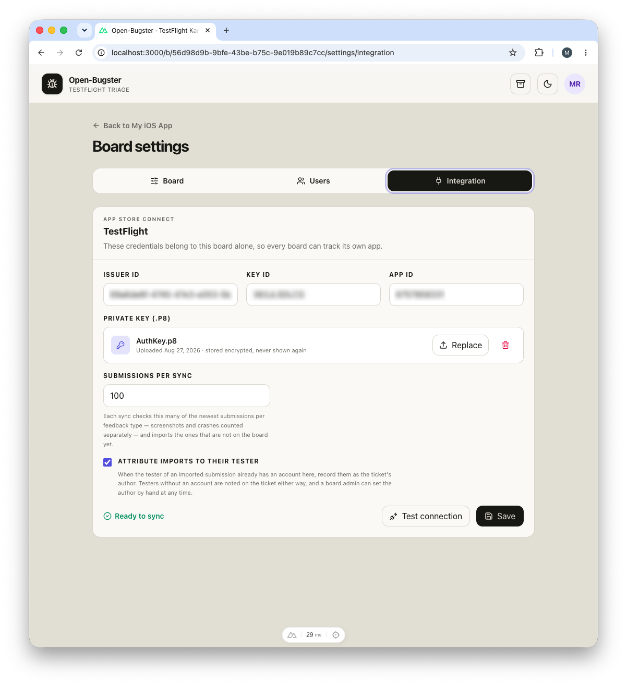

# App Store Connect and the TestFlight import

App Store Connect is the one integration built into Open-Bugster. A board configured with an App Store Connect API key imports TestFlight screenshots and crash reports as tickets, with tester, device, system, locale, build, and the original submission attached. Credentials are configured in the app, per board, so every board tracks its own app. A board without credentials is simply a board.

## Using it

### What is needed

| Value | Where it comes from |
| --- | --- |
| **Issuer ID** | App Store Connect → Users and Access → Integrations → App Store Connect API |
| **Key ID** | Shown next to the generated key; it also appears in the downloaded filename, for example `AuthKey_ABC123DEFG.p8` |
| **Private key (`.p8`)** | Downloaded once when the key is created. Apple does not allow a second download; keep an encrypted backup |
| **App ID** | The numeric App Store Connect resource ID of the app, **not** its bundle ID |

The key needs at least the Developer, App Manager, or Admin role for the app.

### Entering them

Open **Board settings → Integration**, enter issuer ID, key ID, and app ID, upload the `.p8` exactly as downloaded, and save. The key is verified on upload and stored encrypted in the database; it is never written to disk and never sent back to the browser. It can be replaced or removed at any time, but never displayed again.

Never paste the key contents into `.env`, and never commit credentials or private keys.

### Test connection

**Test connection** asks Apple to resolve the configured app with the stored key and reports the app name and bundle ID it reached. It imports nothing and writes nothing. It checks the values currently in the form, saved or not, so a corrected key ID can be verified before storing it; only the `.p8` always comes from the vault.

### Sync

**TestFlight Sync** in the header imports everything that is not on the board yet. The button and the line reporting the last run belong to board administrators. New tickets land in the import lane and carry a `TestFlight` label plus `Screenshot` or `Crash`; screenshots are attached as files.

**Submissions per sync** controls how far back a sync looks. Apple returns feedback newest first; each sync checks this many of the newest submissions per feedback type, screenshots and crashes counted separately. The default is 100 and the maximum 2000.

**Attribute imports to their tester** decides whether an imported submission names its tester as the ticket's author. It is on by default and only takes effect when that tester already has an account; everyone else is still recorded on the ticket as its tester and becomes its author retroactively if invited later.

An archived TestFlight ticket is never imported again.

### Upgrading from a single board

Installations that configured TestFlight through the `ASC_ISSUER_ID`, `ASC_KEY_ID`, `ASC_APP_ID`, and `ASC_PRIVATE_KEY_PATH` variables keep working. On the first start after the upgrade, all existing tickets become a board named **Workboard** whose lanes match the previous columns, and those four values, including the `.p8` read from the path, are imported into it. After that the variables are no longer read and the `.p8` bind mount can be removed. Verify the import under **Board settings → Integration** before deleting anything.

## How it works

- **Apple authentication** is an ES256 JWT signed with the `.p8`, with `kid` set to the key ID and a 19-minute lifetime, minted per request.
- **The key is validated on upload**: at most 16 KB, a `.p8` filename, a PKCS#8 header, and importable as an ES256 key. Then it is sealed with AES-256-GCM and stored on the board row.
- **The encryption key** is `BUGSTER_SECRET_KEY`. By default it is generated on the first start into `secrets.json` in the data volume. An environment value always wins over the generated one. One legacy case remains: an installation that sets `NUXT_SESSION_PASSWORD` but no `BUGSTER_SECRET_KEY` derives the encryption key from the session password, as older versions did; changing that password then makes every stored `.p8` unreadable and the startup log warns about it.
- **A sync is a `sync_runs` row** with a per-board in-flight lock, so two clicks cannot run twice. The first sync on a board looks 90 days back; later syncs start one day before the previous successful run began, and the `syncLimit` caps how many submissions per type are inspected. A run ends as `success`, `partial`, or `failed`.
- **Deduplication** is by Apple's feedback id, stored in `apple_feedback`; archived tickets keep their id, which is what stops a re-import.
- **Imported tickets** land in the import lane, get their title from the feedback, and carry the screenshot as an attachment under the usual attachment policy.
- **Attribution** matches the tester's email against the people table at render time, so the author appears as soon as that person has an account.

## Code map

| File | What lives there |
|---|---|
| [server/utils/app-store-connect.ts](../server/utils/app-store-connect.ts) | `createAppleToken`, `AppleApiError`, the resource helpers, `syncTestFlight` (lock, cutoff, both feedback types, run status), `verifyTestFlightAccess`, `safeAttachmentName`. |
| [server/utils/import-policy.ts](../server/utils/import-policy.ts) | `computeImportCutoff`, `isWithinImportWindow`, `titleFromFeedback`. |
| [server/utils/private-key-policy.ts](../server/utils/private-key-policy.ts) | `MAX_PRIVATE_KEY_SIZE`, `safeKeyFilename`, `validatePrivateKey`. |
| [server/utils/secret-box.ts](../server/utils/secret-box.ts) | `encryptSecret`, `decryptSecret`, `secretKeyAvailable`, the legacy derivation. |
| [server/utils/runtime-secrets.ts](../server/utils/runtime-secrets.ts), [server/plugins/00-runtime-secrets.ts](../server/plugins/00-runtime-secrets.ts) | Generating and loading `secrets.json`. |
| [server/operations/board-domain.ts](../server/operations/board-domain.ts) | `board.setKey`, `board.clearKey`, `board.testConnection`, `import.run` (board admin); `import.status` (viewer). |
| [server/utils/db.ts](../server/utils/db.ts) | `ensureBoardSyncLimit`, `ensureBoardAutoAuthor`, `ensureImportStatus`; `setBoardPrivateKey`, `clearBoardPrivateKey`, `boardSyncCredentials`, the sync-run and feedback functions. Tables `apple_feedback`, `sync_runs`. |
| [server/utils/config.ts](../server/utils/config.ts) | The legacy `ASC_*` variables, read once for the single-board upgrade. |
| `app/components/BoardTestFlightSettings.vue`, `app/pages/b/[board]/settings/integration.vue` | The settings form, test connection, sync options. |
| `app/components/AppHeader.vue` | The **TestFlight Sync** button and last-run line. |

## Surfaces

- **Internal routes:** `server/api/boards/[id]/key.post.ts`, `key.delete.ts`, `test-connection.post.ts`; `server/api/import/testflight.post.ts`, `latest.get.ts`.
- **REST v1:** `GET /boards/{boardId}/import` (last run), `POST /boards/{boardId}/import` (run a sync). Credentials are not on the public surface.
- **MCP:** none. An agent sees imported tickets like any other.
- **Webhooks:** `import.completed`.

## Tests

- `tests/apple-jwt.test.ts`: the ES256 token's header and claims.
- `tests/import-policy.test.ts`: the cutoff window and title derivation.
- `tests/secret-box.test.ts`: encrypt and decrypt round-trip.
- `tests/runtime-secrets.test.ts`: `secrets.json` generation and environment precedence.

## Configuration

| Variable | Purpose |
|---|---|
| `BUGSTER_SECRET_KEY` | Encrypts the stored `.p8` keys. Generated when unset; set it (`openssl rand -base64 32`) before uploading a key if you want to manage it yourself. |
| `ASC_ISSUER_ID`, `ASC_KEY_ID`, `ASC_APP_ID`, `ASC_PRIVATE_KEY_PATH` | Legacy, read once on the first start after upgrading from a single-board installation. |
