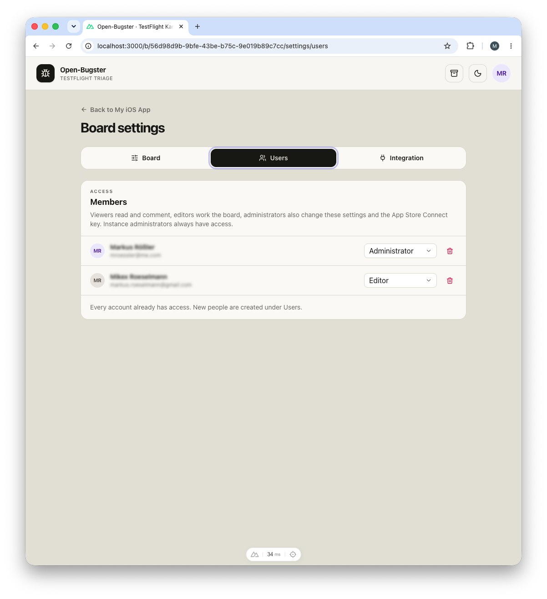

# Users and access

Open-Bugster is built for a small team sharing one instance. An account is its email address: that address is the sign-in name, and it is what every ticket, comment, and imported TestFlight report is matched against. Roles exist on two levels, instance and board, and are deliberately few.

## Using it

### Identity by email

Matching happens when a page is rendered, not when a ticket is written. A TestFlight report from `jane@example.com` shows the raw address for as long as no account carries it. Create an account with that address a month later and every one of her past reports shows her name and avatar, with no re-import. The same holds for a rename: changing your name in **Your profile** updates it on everything you have ever written.

### Roles

| Instance role | What it allows |
| --- | --- |
| **Owner** | The account seeded on first start. Like an administrator, but cannot be demoted, disabled, or deleted. |
| **Administrator** | Manages accounts, creates workspaces, and has access to every workspace and board. |
| **Member** | Sees only the boards they have been added to, and the workspaces around them. |

| Board role | What it allows |
| --- | --- |
| **Viewer** | Read the board and write comments. |
| **Editor** | Everything a viewer can do, plus creating, editing, moving, and archiving tickets. |
| **Administrator** | Everything an editor can do, plus the archive, running a TestFlight sync, lanes, categories, members, webhooks, the audit log, the App Store Connect key, and deleting the board. |

Instance administrators always reach every board, so nobody can lock themselves out of their own server. Whether a person may also act on a board through a token is a separate **Integration** permission; see [api.md](api.md).

### Adding someone

Open-Bugster sends no mail, so an invitation is a link you pass on yourself. Under **Users** in the account menu, enter the person's email and name; the app creates the account and shows a one-time link, valid for seven days, beneath their row. They open it, choose a password, and are signed in.

Each row reports what its link is doing: *expires in 5 days*, *expired*, or *no invitation link*. Only the hash of a link is stored, so it is shown exactly once. **Hide** closes the panel without revoking anything. **New link** issues a fresh one and invalidates the previous. **Revoke** stops the current link and leaves the account in place.

The account exists from the moment you create it, so it can already be added to boards and assigned tickets. Inviting an address that Open-Bugster already knows, because a tester used it or an old ticket names it, claims that same person rather than opening a second one.

### A forgotten password

**Reset password** on the person's row issues the same kind of one-time link, valid for seven days. The old password keeps working while the link is outstanding; the moment it is used, the old password stops working and every other session of that account is signed out. A disabled account gets no link; enable it first. The owner account is reset with `npm run owner:reset` on the server instead, so that holding an administrator account is not a way to take it over; see [setup.md](setup.md#if-nobody-can-sign-in).

### Disable, anonymize, delete

**Disable** blocks sign-in and ends any open session, while keeping everything the account wrote. Its tokens stop working too.

**Anonymize** erases the person and keeps their work. Name and email are removed everywhere, including inside each ticket's history, while every ticket, comment, and assignment stays where it is and stays recognisable as one person's. They are dropped from every board and can no longer sign in. This cannot be undone: an anonymized account cannot be renamed, re-enabled, or invited back, because that would hand the erased person's history to whoever the row was pointed at next.

**Delete** removes the account outright. Its tickets, comments, and history stay on the boards but lose the person behind them. Anonymize when the history should still read as somebody's; delete only when the row itself should not exist.

### Members of a board

**Board settings → Users** lists who has access and at what role, and board administrators add and remove people and change their role there. Anyone else who has the address sees the roster without controls. A board always keeps at least one administrator.

### Your profile

Name, email address, and password live under **Your profile** in the account menu. Changing your address moves everything you have filed, written, or been assigned along with you, and the old address becomes free again. If the new address is one Open-Bugster already knew, that history is folded into your account. An address another account holds is refused. Changing your password signs out every other device.

## Erasure without losing the work

Anonymizing exists because of Article 17 of the [GDPR](https://eur-lex.europa.eu/eli/reg/2016/679/oj), the right to erasure. On a shared board that is normally a painful request to receive: deleting the account takes the person's tickets, comments, and history with it or leaves them orphaned.

The regulation does not ask for that. Personal data is what identifies someone (Article 4(1)), here the name and the email address; the tickets are not. Recital 26 puts data that can no longer be tied back to a person outside the scope entirely, with identifiability judged by "all the means reasonably likely to be used" to get back to the person.

So Open-Bugster separates the two. **Anonymize** clears the email, the name, and the password hash from the account row, drops the person from every board, and invalidates every session. The row itself stays, and everything written by it keeps pointing at it. Because the history stores people by reference rather than by address, an entry that read *Jane Doe moved this to Review* becomes *Deleted user moved this to Review* without a single row being rewritten. And because the app keeps no way back, what remains is anonymous in the sense Recital 26 means, not merely pseudonymous under Article 4(5). That also settles retention under Article 5(1)(e): anonymous data can stay for as long as the board is useful.

**What it does not cover.** Anonymizing touches accounts, not the text on the board. A name or address typed into a title, description, or comment, or carried in an imported report or an attachment, has to be edited by hand. Open-Bugster is self-hosted, which makes whoever runs the instance the controller under Article 4(7): the legal basis, the retention policy, and answering a request within the month Article 12(3) allows are theirs. This is not legal advice.

## How it works

- **People are rows in `users`, referenced by id.** Contacts that have never signed in (a tester, an author of an old ticket) live in the same table with `status` marking them; `upsertContactByEmail` claims or creates the row, and inviting an address promotes it to an account. Everything after the `ensurePersonIdentity` migration speaks person ids.
- **Sessions carry a version.** Every request compares the cookie's `sessionVersion` with the account row; a password change, reset, disable, or anonymize bumps it and signs every other session out.
- **Invites and resets are hashed tokens** with a seven-day expiry, shown once. Using a reset invalidates the old password; an unused one lapses.
- **The owner is seeded once**, from `APP_ADMIN_EMAIL` and `APP_ADMIN_PASSWORD` or `APP_PASSWORD_HASH`, only when the users table is empty. Passwords are hashed with scrypt.
- **Service identities** are accounts that cannot sign in and act only through tokens; see [api.md](api.md).
- **Instance administration is cookie-only.** `user.*` operations require the instance scope, which also demands an `admin`-scoped token and refuses board-pinned ones, and none of them are on the public REST surface.

## Code map

| File | What lives there |
|---|---|
| [server/operations/accounts.ts](../server/operations/accounts.ts) | `user.list`, `user.create`, `user.update`, `user.delete`, `user.anonymize`, `user.invite`, `user.revokeInvite` (instance admin); `profile.update`, `profile.changePassword` (authenticated). |
| [server/operations/board-domain.ts](../server/operations/board-domain.ts) | `member.list`, `member.candidates`, `member.set`, `member.remove`. |
| [server/middleware/auth.ts](../server/middleware/auth.ts) | Cookie and bearer authentication, the public paths, the session version check. |
| [server/utils/access.ts](../server/utils/access.ts) | The guards and role ranks. See [architecture.md](architecture.md#access-rules). |
| [server/utils/actor.ts](../server/utils/actor.ts), [session.ts](../server/utils/session.ts) | The `Actor`, `sessionActor`, `refreshSession` after a profile change. |
| [server/utils/invite.ts](../server/utils/invite.ts), [password.ts](../server/utils/password.ts) | Invite and reset links (seven days, hashed); scrypt hashing and verification. |
| [server/utils/db.ts](../server/utils/db.ts) | `ensureUsers` (owner seed), `warnWhenNobodyCanSignIn`, `ensurePersonIdentity`; `personById`, `upsertContactByEmail`, `findUserByEmail`, `createUser`, `updateUser`, `deleteUser`, `anonymizeUser`, `setUserPassword`, `boardMembers`, `setBoardMember`, `removeBoardMember`, `countBoardAdmins`. Tables `users`, `board_members`. |
| [server/utils/config.ts](../server/utils/config.ts) | The bootstrap variables. |
| `scripts/reset-owner.mjs`, `scripts/hash-password.mjs` | `npm run owner:reset`, `npm run password:hash`. |
| `app/composables/useAuth.ts`, `app/middleware/auth.global.ts` | The session on the client and the redirect to `/login`. |
| `app/pages/login.vue`, `invite/[token].vue` | Sign-in; accepting an invitation or a reset. |
| `app/pages/admin/users.vue` | The **Users** page: create, invite, reset, disable, anonymize, delete, service identities. |
| `app/pages/profile/index.vue`, `security.vue`, `boards.vue` | Your profile, password, and board memberships. |
| `app/components/BoardMemberSettings.vue`, `UiAvatar.vue` | The board roster; avatars and initials. |

## Surfaces

- **Internal routes:** `server/api/auth/login.post.ts`, `logout.post.ts`; `server/api/users/index.get.ts`, `index.post.ts`, `[id].patch.ts`, `[id].delete.ts`, `[id]/anonymize.post.ts`, `[id]/invite.post.ts`, `[id]/invite.delete.ts`; `server/api/invite/[token].get.ts`, `[token].post.ts`; `server/api/profile/index.patch.ts`, `password.post.ts`; `server/api/boards/[id]/members/*`.
- **REST v1:** board membership only (`/boards/{boardId}/members`, `/member-candidates`). User administration is deliberately absent, and a test keeps it that way.
- **MCP:** `whoami` reports the principal behind the token. No user tools.
- **Webhooks:** none.

## Tests

- `tests/accounts.test.ts`: accounts, invitations, resets, disable, anonymize, delete, board membership.
- `tests/person-identity.test.ts`: the email-to-id migration against a legacy snapshot.
- `tests/owner-seed.test.ts`: first-start seeding from the environment.
- `tests/password.test.ts`: scrypt hashing.
- `tests/access.test.ts`: role ranking and the guards.
- `tests/api-v1.test.ts`: instance administration stays off the public surface.

## Configuration

| Variable | Purpose |
|---|---|
| `APP_ADMIN_EMAIL` | The owner's address, read once on the first start. |
| `APP_ADMIN_PASSWORD` or `APP_PASSWORD_HASH` | The owner's initial password (at least 12 characters) or its scrypt hash; the hash wins. |
| `APP_ADMIN_FIRST_NAME`, `APP_ADMIN_LAST_NAME`, `APP_USERNAME` | Optional name parts; `APP_USERNAME` only feeds the fallback address `<name>@localhost`. |
| `NUXT_SESSION_PASSWORD` | Signs the session cookie; generated into `secrets.json` when unset. |
| `NUXT_SESSION_COOKIE_SECURE` | Set to `true` behind HTTPS. |
